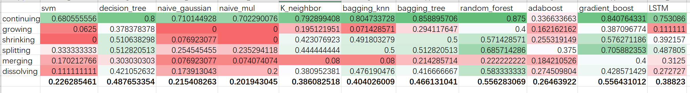

# ICSOC2020 Community-Based Service Ecosystem Evolution Analysis

## Data Description
In `data` dictionary, we release our data used in this paper. The release dataset collection 
and processing process can refer to our previous work.
```latex
@misc{liu2020datadriven,
    title={A Data-driven Approach for Constructing Multilayer Network-based Service Ecosystem Models},
    author={Mingyi Liu and Zhiying Tu and Xiaofei Xu and Zhongjie Wang},
    year={2020},
    eprint={2004.10383},
    archivePrefix={arXiv},
    primaryClass={cs.CY}
}
```
Related code be found in:

* [MSEM-EventExtraction](https://github.com/icecity96/eventextraction)
* [MSEM-EvolutionaryRelationGenerate](https://github.com/icecity96/MSEM-EvolutionaryRelationGenerate)

`data/nodes.json`: Each line represents a node in the json format. Each node contains following fields:

| field | description | example | note |
| --- | --- | --- | --- |
| id | node unique id | ofo | - |
| label | node label | ofo | for service and stakeholder label is same as id|
| type | node type | Stakeholder | In this paper, we only use Stakeholder and Service |

`data/edges.json`: Each line represents an edge in the json format. Each edge contains following fields:

| field | description | example | note |
| --- | --- | --- | --- |
| id | edge unique id | .... | - |
| source | source node id | 9 |- |
| target | target node id | HappyCycle | - |
| timestamp | when the edge was created | 2019-08-12 | Structure relation will be set to 1999-01-01 |
| type | the edge type | evolutionary | HasX, structural or evolutionary |
| r | the edge semantics type | BelongTo | this attribute will be used to aging function |
| generated_from | where the edge generated from | 9 |this attribute only for evolutionary type edge |

Service ecosystem snapshots generation, static community detection, nodes' social position calculation
are time consuming. So we provide a copy of our intermediate results, which have been stored in `data/*.pkl`. 
You can use this data to save your time.

## Source code
* `generate_snapshots.py`: this script mainly contains `aging function` and Service Ecosystem snapshots 
steps
* `community_features.py`: this script contains some common used community features.
* `community_options.py`: this script contains **community detection**, **meta community identifier**, 
**community evolutionary event detection**, **community features vector construction**, etc.
* `model_operations.py`: this script contains how to train the service community evolutionary event prediction model.
And apply the [SHAP](https://github.com/slundberg/shap) explainer on the model.
* `report.py`: this script mainly contains how to visualize the analysis results.
* `test.py`: this script gives an example of whole process. (Notebook version will come soon)

## Report
Generated figures are stored in `figure` folder with `.html` format.
* `summary_{evolution_evnt}.html`: the summary report of `evolution_evnt` shows the importance of different features (merged) to the event.
* `dependency_{feature}_{evolution_evnt}.html`: the dependency report gives much detailed information.

Please refer to the paper to get more details.


## Appendix
### Evaluate on different classifiers


In our paper, we chose random forest. You can chose other prediction mode. All you need to do is
moddify the function `train_prediction_model` in `model_operations.py`.
```python
if model_name == "random_forest":
    model = RandomForestClassifier(n_estimators=50)
elif model_name == "xxxx": #modify here, and change params value
    model = XxxxClassifier(mmmm=xxx)
```

## Contact
If you have any questions, feel free to contact us

**liumy@hit.edu.cn**
